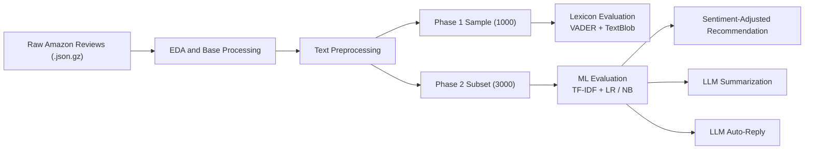

# Amazon Sentiment Analysis & Recommender System

[](https://www.python.org/)
[](https://scikit-learn.org/)
[](https://huggingface.co/docs/transformers/index)
[](https://pandas.pydata.org/)
[](https://numpy.org/)
[](#)

An end-to-end NLP portfolio project that transforms raw Amazon reviews into a sentiment analysis pipeline, improves classification with classical machine learning, and uses predicted sentiment to support downstream recommendation and LLM-based customer experience tasks.

## Executive Summary
This project explores how review text can be turned into decision-ready signals across multiple layers of an intelligent product analytics workflow.

Starting from the Amazon Industrial & Scientific review dataset, the pipeline:
- audits and prepares raw customer feedback
- benchmarks lexicon-based sentiment methods such as VADER and TextBlob
- improves sentiment classification with TF-IDF + Logistic Regression / Naive Bayes
- uses predicted sentiment to adjust product ranking in a recommender-style workflow
- extends the system with LLM-powered summarization and automated customer replies

The result is a practical NLP system that connects data engineering, text preprocessing, model evaluation, recommendation logic, and applied generative AI in one reproducible repository.

## Why This Project Matters
Customer reviews contain far more signal than star ratings alone. Raw ratings are useful, but they often miss nuance:
- neutral or mixed opinions are hard to capture with simple heuristics
- negative sentiment can be understated in ratings but explicit in text
- product ranking can improve when textual sentiment is considered alongside numeric review signals

The underlying Amazon Industrial & Scientific dataset is also strongly skewed toward positive reviews, which makes sentiment classification more realistic and more challenging. This project demonstrates how sentiment analysis can move from simple polarity scoring to a more robust decision-support component for ranking products and supporting customer interaction workflows.

## Core Capabilities
- Lexicon-based sentiment analysis with VADER and TextBlob
- Machine learning sentiment modeling with Logistic Regression and Naive Bayes
- Class imbalance handling and hyperparameter tuning with Grid Search
- Phase-based evaluation using stratified subsets
- Sentiment-enhanced recommender logic using adjusted ratings
- LLM-based review summarization
- LLM-based automated customer support reply generation

## Dataset
The project uses the Amazon Review Data (2018) collection by Jianmo Ni (UCSD).

Source:
[Amazon Review Data (2018)](https://nijianmo.github.io/amazon/index.html)

Required category:
`Amazon Industrial & Scientific`

Before running the pipeline, download the dataset and place it here:

```text
data/raw/Industrial_and_Scientific.json.gz
```

The raw dataset is not stored in this repository and must be added locally before execution.

## Architecture


## Technical Approach
### 1. Data Exploration
The pipeline begins with loading and profiling the Amazon Industrial & Scientific review data. Initial exploration focuses on rating distributions, missing values, review lengths, duplicates, and general data quality checks.

### 2. Text Preprocessing
Three separate preprocessing strategies are used because each modeling family benefits from a different representation:
- `text_vader`: minimal cleaning to preserve punctuation, emphasis, and cues that VADER uses
- `text_textblob`: normalized text for lexicon-style polarity analysis
- `text_ml`: ML-ready normalized text for TF-IDF vectorization with classical classifiers

The preprocessing stage also creates stratified subsets for both project phases:
- `sample_1000.csv` for Phase 1 experiments
- `phase2_subset_3000.csv` for Phase 2 machine learning experiments

### 3. Sentiment Modeling
The project compares two categories of sentiment models:
- rule/lexicon-based approaches: VADER and TextBlob
- supervised ML approaches: Logistic Regression and Multinomial Naive Bayes

For the ML pipeline, TF-IDF features are used with a stratified 70/30 train-test split, class-aware evaluation, and tuned model selection. Hyperparameter search is guided by F1-score rather than raw accuracy so minority-class performance is not washed out by the dominant positive class.

### 4. Recommendation Layer
Predicted sentiment is used to adjust review-derived ratings and produce a recommendation-oriented product ranking. This demonstrates how NLP output can influence downstream product prioritization rather than remain an isolated classification result.

### 5. LLM Applications
Two lightweight generative AI use cases sit on top of the sentiment workflow:
- summarizing long customer reviews into concise takeaways
- generating customer-support-style replies for question-containing reviews

## Results
Key takeaways from the project:
- tuned Logistic Regression improved overall classification quality compared with lexicon baselines
- machine learning handled neutral and negative classes more effectively than simpler rule-based approaches
- sentiment-informed rating adjustment produced a richer product ranking signal than raw ratings alone
- class weighting and F1-driven tuning materially improved recall and balance across underrepresented classes
- Naive Bayes remained a useful benchmark, but Logistic Regression delivered the strongest overall performance in this setup

This creates a stronger end-to-end story than a standalone sentiment classifier: the text analytics outputs are connected directly to practical downstream business use cases.

## Tech Stack
- Python
- Pandas
- NumPy
- Matplotlib
- Seaborn
- NLTK
- scikit-learn
- TextBlob
- VADER Sentiment
- Hugging Face Transformers
- PyTorch

## Repository Structure
```text
amazon-industrial-sentiment-analysis/
├── data/
│   ├── raw/
│   │   └── Industrial_and_Scientific.json.gz
│   └── processed/
├── results/
│   ├── figures/
│   ├── metrics/
│   └── models/
├── data_exploration.py
├── preprocessing.py
├── model_evaluation.py
├── recommender.py
├── summarization.py
├── auto_reply.py
├── requirements.txt
├── README.md
└── .gitignore
```

### Folder Guide
- `data/raw/`: local raw dataset files downloaded from the source
- `data/processed/`: intermediate and prepared datasets generated by the pipeline
- `results/figures/`: plots and visual outputs from EDA and evaluation
- `results/metrics/`: evaluation outputs, prediction tables, summaries, and recommendation files
- `results/models/`: serialized trained models and related artifacts

### Script Guide
- [`data_exploration.py`](/Users/mateoff/Desktop/Centennial/6-semestre/NPL/project/amazon-industrial-sentiment-analysis/data_exploration.py): loads raw reviews, performs EDA, and creates the base processed dataset
- [`preprocessing.py`](/Users/mateoff/Desktop/Centennial/6-semestre/NPL/project/amazon-industrial-sentiment-analysis/preprocessing.py): labels sentiment, applies preprocessing pipelines, and creates Phase 1 and Phase 2 subsets
- [`model_evaluation.py`](/Users/mateoff/Desktop/Centennial/6-semestre/NPL/project/amazon-industrial-sentiment-analysis/model_evaluation.py): evaluates VADER, TextBlob, Logistic Regression, and Naive Bayes
- [`recommender.py`](/Users/mateoff/Desktop/Centennial/6-semestre/NPL/project/amazon-industrial-sentiment-analysis/recommender.py): builds sentiment-adjusted product rankings
- [`summarization.py`](/Users/mateoff/Desktop/Centennial/6-semestre/NPL/project/amazon-industrial-sentiment-analysis/summarization.py): summarizes long reviews with a local Hugging Face model
- [`auto_reply.py`](/Users/mateoff/Desktop/Centennial/6-semestre/NPL/project/amazon-industrial-sentiment-analysis/auto_reply.py): generates customer-service-style replies for question-like reviews

## Getting Started
### 1. Clone the repository
```bash
git clone <your-repo-url>
cd amazon-industrial-sentiment-analysis
```

### 2. Create a virtual environment
```bash
python3 -m venv .venv
source .venv/bin/activate
```

### 3. Install dependencies
```bash
pip install -r requirements.txt
```

### 4. Download the dataset
Download `Amazon Industrial & Scientific` from the [Amazon Review Data (2018)](https://nijianmo.github.io/amazon/index.html) page and save it as:

```text
data/raw/Industrial_and_Scientific.json.gz
```

## Run Order
Execute the pipeline in the following order.

### Step 1. Data exploration and base processing
```bash
python3 data_exploration.py
```
Creates the base dataset and exploratory outputs used downstream.

### Step 2. Text preprocessing
```bash
python3 preprocessing.py
```
Creates:
- `data/processed/preprocessed_full.csv`
- `data/processed/sample_1000.csv`
- `data/processed/phase2_subset_3000.csv`

### Step 3. Sentiment model evaluation
```bash
python3 model_evaluation.py
```
Runs lexicon baselines and ML models, then saves evaluation outputs, predictions, figures, and model artifacts.

### Step 4. Sentiment-enhanced recommender
```bash
python3 recommender.py
```
Builds product ranking outputs using adjusted ratings derived from predicted sentiment.

### Step 5. Review summarization
```bash
python3 summarization.py
```
Generates short summaries for long reviews using a Hugging Face seq2seq model.

### Step 6. Automated reply generation
```bash
python3 auto_reply.py
```
Generates customer-support-style responses for review texts that contain questions.

## Main Outputs
- `data/processed/base_reviews.csv`
- `data/processed/preprocessed_full.csv`
- `data/processed/sample_1000.csv`
- `data/processed/phase2_subset_3000.csv`
- `results/figures/`
- `results/metrics/`
- `results/models/`

## Portfolio Highlights
This repository is a strong portfolio piece because it demonstrates:
- end-to-end ownership from raw data to downstream product use case
- practical NLP model comparison rather than a single-model demo
- thoughtful preprocessing tailored to different modeling strategies
- metric selection discipline by prioritizing F1-score under class imbalance instead of relying only on accuracy
- integration of classical ML and modern LLM workflows
- an applied business layer through recommendation logic

## Notes
- Raw datasets, processed outputs, and trained models are intentionally excluded from version control.
- Hugging Face model downloads may take time on first run because model weights are fetched locally.
- Some scripts depend on outputs generated by earlier steps, so the run order above should be followed.

## Assumptions And Limitations
- Star ratings are used as proxy sentiment labels, which is practical but imperfect because numeric ratings do not always fully match the written review tone.
- The recommendation layer is sentiment-enhanced rather than a full collaborative filtering system, so it is best understood as an NLP-informed ranking prototype.
- LLM auto-reply quality depends on heuristic question detection and prompt design, which can occasionally produce overly generic responses.

## Future Improvements
- package the workflow into a single CLI or orchestrated pipeline
- add experiment tracking for hyperparameter comparisons
- expose recommendation and LLM features through a lightweight web app
- add unit tests for preprocessing, sampling, and scoring logic
